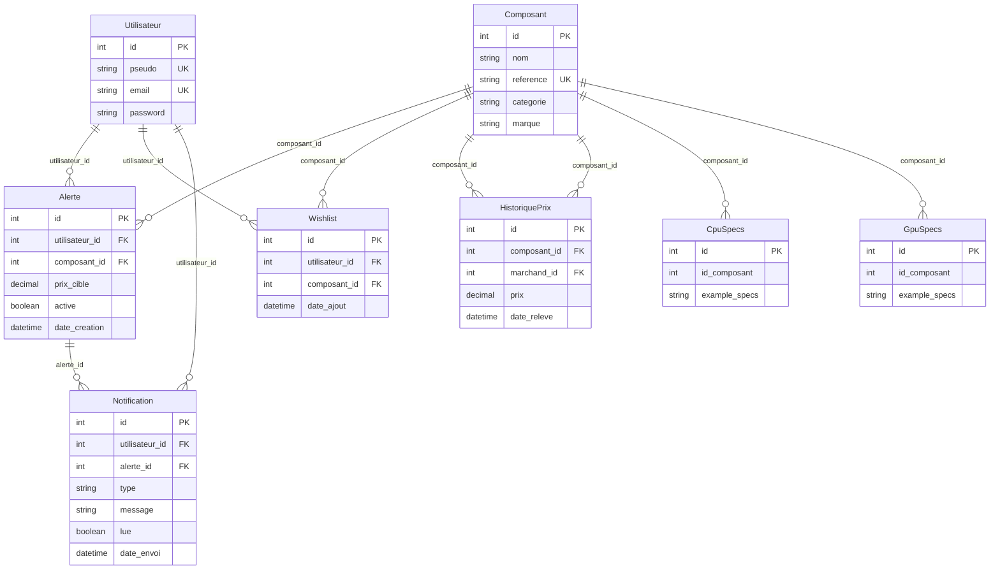

# InteliScrap
A tool to help you build your very own custom computer with advanced component research and price comparison algorithms

# Brief InteliScrap

## Concept
Application de comparaison et suivi de prix pour composants informatiques, avec intelligence artificielle pour conseiller les utilisateurs.

## Fonctionnalités principales

### Recherche multi-sites
- Agrégation de prix depuis plusieurs plateformes (Amazon, eBay, etc.)
- Filtrage par continent/région
- Comparaison instantanée des offres

### Suivi des prix
- Historique des prix sous forme de graphiques
- Visualisation des tendances sur la durée
- Identification du meilleur moment pour acheter

### Conseils IA
- Recommandations personnalisées sur les composants
- Aide au choix selon le budget et les besoins
- Alertes intelligentes sur les bonnes affaires

### Notifications
- Alertes de baisse de prix
- Notifications de deals limités dans le temps
- Suivi des composants en wishlist

## Cible
Jeunes adultes (18-30 ans) passionnés de tech, gamers, créateurs de contenu, avec budget limité cherchant le meilleur rapport qualité/prix.

## Valeur ajoutée
Gain de temps, économies d'argent, conseils d'expert accessible à tous, tout-en-un pour l'achat de composants PC.

## V-0.1
- Scrap --> AMAZON
- Charactéristiques CPU
- Alertes (Phone & Email) sur les tarifs (Pourcentages proposés)