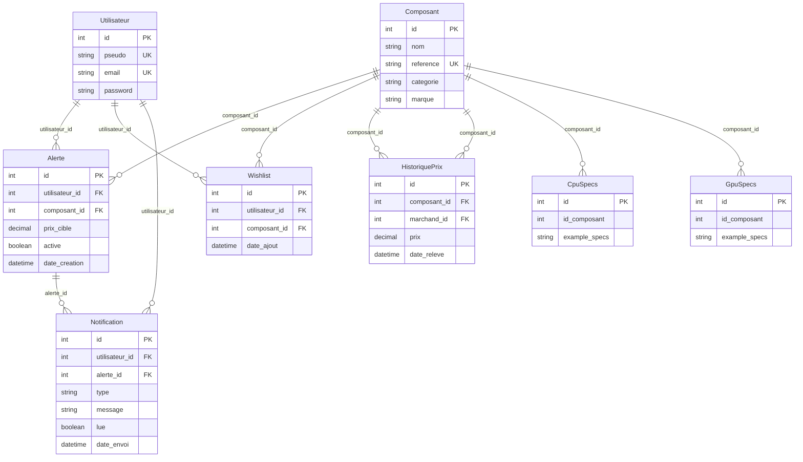

# InteliScrap
A tool to help you build your very own custom computer with advanced component research and price comparison algorithms

---

## 🚀 Démarrage rapide

Toute la stack (frontend, backend, base de données) tourne via Docker Compose.

### Prérequis
- [Docker](https://docs.docker.com/get-docker/) **≥ 24**
- Docker Compose v2 (inclus dans Docker Desktop)
- Les ports `5173`, `8000` et `5433` libres sur la machine hôte

### Lancer le projet

```bash
git clone https://github.com/AugusteDollinger/InteliScrap.git
cd InteliScrap
./startup.sh                 # = docker compose -f infra-inteliscrap/docker-compose.yml up
```

Au premier lancement, les images sont construites (compter quelques minutes).
Pour lancer en arrière-plan : ajouter `-d`.

```bash
docker compose -f infra-inteliscrap/docker-compose.yml up -d --build
```

### Vérifier que tout tourne

```bash
curl http://localhost:8000/health
# -> {"status":"healthy","message":"InteliScrap API is running"}
```

### Services & URLs

| Service   | URL                              | Détails                                  |
|-----------|----------------------------------|------------------------------------------|
| Frontend  | http://localhost:5173            | React 19 + Vite (HMR activé)             |
| Backend   | http://localhost:8000            | FastAPI                                   |
| API docs  | http://localhost:8000/docs       | Swagger UI auto-généré                    |
| Health    | http://localhost:8000/health     | Sonde de disponibilité                    |
| PostgreSQL| `localhost:5433`                 | Postgres 15 (DB interne sur `postgres:5432`) |

> ℹ️ Le port hôte de Postgres est `5433` (et non `5432`) pour éviter tout conflit
> avec une instance Postgres déjà présente sur la machine. À l'intérieur du réseau
> Docker, le backend contacte la base via `postgres:5432`.

### Compte par défaut

Un administrateur est créé automatiquement au démarrage du backend :

| Email                | Mot de passe |
|----------------------|--------------|
| `admin@example.com`  | `admin`      |

> ⚠️ À usage de développement uniquement — à changer / désactiver avant toute mise en production.

---

## 🛠️ Développement

### Commandes utiles

```bash
# Logs en direct
docker compose -f infra-inteliscrap/docker-compose.yml logs -f backend
docker compose -f infra-inteliscrap/docker-compose.yml logs -f frontend

# Exécuter une commande dans un conteneur (helpers fournis)
./back.sh <cmd>      # ex: ./back.sh alembic upgrade head
./front.sh <cmd>     # ex: ./front.sh pnpm lint

# Arrêter la stack
docker compose -f infra-inteliscrap/docker-compose.yml down

# Tout réinitialiser (⚠️ supprime les données de la base)
docker compose -f infra-inteliscrap/docker-compose.yml down -v
```

### Migrations de base de données (Alembic)

```bash
./back.sh alembic upgrade head                       # appliquer les migrations
./back.sh alembic revision --autogenerate -m "msg"   # générer une migration
```

### Structure du projet

```
InteliScrap/
├── infra-inteliscrap/      # Docker Compose (orchestration des services)
├── backend/                # API FastAPI
│   ├── app/
│   │   ├── api/            # Routes (v1)
│   │   ├── models/         # Modèles SQLAlchemy
│   │   ├── schemas/        # Schémas Pydantic
│   │   ├── services/       # Logique métier
│   │   ├── database.py     # Connexion DB
│   │   └── main.py         # Point d'entrée FastAPI
│   └── alembic/            # Migrations
├── frontend/               # SPA React 19 + Vite + TypeScript
│   └── src/
├── back.sh / front.sh      # Helpers d'exécution dans les conteneurs
└── startup.sh              # Lancement de la stack
```

### Stack technique

- **Frontend** : React 19, TypeScript, Vite 7, React Router 7, Sass
- **Backend** : FastAPI, SQLAlchemy 2, Alembic, Pydantic 2, Playwright (scraping)
- **Base de données** : PostgreSQL 15
- **Auth** : JWT (python-jose), hash de mot de passe Argon2

### Dépannage

| Problème | Solution |
|----------|----------|
| `Bind for 0.0.0.0:5432 failed: port is already allocated` | Un Postgres tourne déjà sur l'hôte ; le port DB est mappé sur `5433` (voir compose). |
| Le backend ne build pas (`psycopg2-binary`) | L'image est épinglée sur `python:3.12-slim` (les wheels n'existent pas pour `python:latest`). |
| Frontend inaccessible | Vérifier les logs : `docker compose ... logs -f frontend` (l'install pnpm a lieu au runtime). |

---

# Brief InteliScrap

## Concept
Application de comparaison et suivi de prix pour composants informatiques, avec intelligence artificielle pour conseiller les utilisateurs.

## Fonctionnalités principales

### Recherche multi-sites
- Agrégation de prix depuis plusieurs plateformes (Amazon, eBay, etc.)
- Filtrage par continent/région
- Comparaison instantanée des offres

### Suivi des prix
- Historique des prix sous forme de graphiques
- Visualisation des tendances sur la durée
- Identification du meilleur moment pour acheter

### Conseils IA
- Recommandations personnalisées sur les composants
- Aide au choix selon le budget et les besoins
- Alertes intelligentes sur les bonnes affaires

### Notifications
- Alertes de baisse de prix
- Notifications de deals limités dans le temps
- Suivi des composants en wishlist

## Cible
Jeunes adultes (18-30 ans) passionnés de tech, gamers, créateurs de contenu, avec budget limité cherchant le meilleur rapport qualité/prix.

## Valeur ajoutée
Gain de temps, économies d'argent, conseils d'expert accessible à tous, tout-en-un pour l'achat de composants PC.



```mermaid
erDiagram
    Utilisateur {
        int id PK
        string pseudo UK
        string email UK
        string password
    }
    
    Composant {
        int id PK
        string nom
        string reference UK
        string categorie
        string marque
    }

    GpuSpecs {
        int id PK
        int id_composant
        string example_specs
    }
    
    CpuSpecs {
        int id PK
        int id_composant
        string example_specs
    } 
    
    Alerte {
        int id PK
        int utilisateur_id FK
        int composant_id FK
        decimal prix_cible
        boolean active
        datetime date_creation
    }
    
    Wishlist {
        int id PK
        int utilisateur_id FK
        int composant_id FK
        datetime date_ajout
    }
    
    Notification {
        int id PK
        int utilisateur_id FK
        int alerte_id FK
        string type
        string message
        boolean lue
        datetime date_envoi
    }
    
    HistoriquePrix {
        int id PK
        int composant_id FK
        int marchand_id FK
        decimal prix
        datetime date_releve
    }

    Utilisateur ||--o{ Alerte : "utilisateur_id"
    Utilisateur ||--o{ Wishlist : "utilisateur_id"
    Utilisateur ||--o{ Notification : "utilisateur_id"

    Composant ||--o{ Alerte : "composant_id"
    Composant ||--o{ Wishlist : "composant_id"
    Composant ||--o{ HistoriquePrix : "composant_id"
    Composant ||--o{ HistoriquePrix : "composant_id"
    Composant ||--o{ CpuSpecs : "composant_id"
    Composant ||--o{ GpuSpecs : "composant_id"
    
    Alerte ||--o{ Notification : "alerte_id"
```

## V-0.1
- Scrap --> AMAZON
- Charactéristiques CPU
- Alertes (Phone & Email) sur les tarifs (Pourcentages proposés)